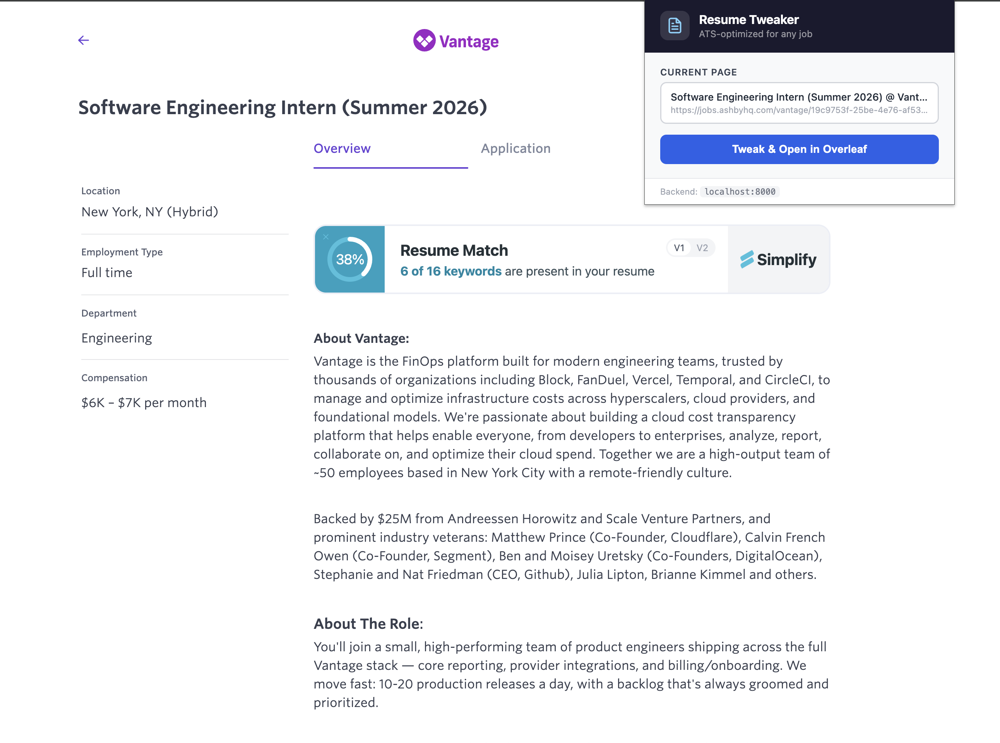
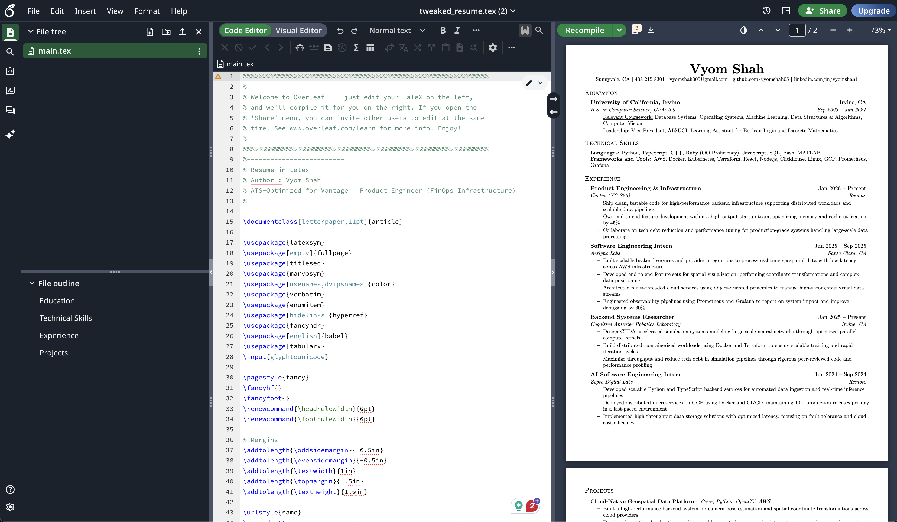

# Resume Tweaker

Resume Tweaker is a tool that automatically tailors a LaTeX resume to a specific job posting using AI, then opens the result directly in Overleaf for editing. It consists of a Python backend API and a Chrome extension that captures job descriptions from any webpage with a single click.

---

## How It Works

1. Navigate to any job listing in your browser.
2. Click the Resume Tweaker Chrome extension icon.
3. Click **Tweak & Open in Overleaf**.
4. The extension extracts the full page text and sends it to the local backend.
5. The backend calls the Gemini API, which rewrites the base LaTeX resume to align with the job description — incorporating relevant keywords for ATS optimization without fabricating experience.
6. The tweaked LaTeX is passed to Overleaf via an auto-submitted form, opening a new document instantly.

---

## Screenshots

### Chrome Extension



### Generated Resume in Overleaf



---

## Tech Stack

| Layer | Technology |
|---|---|
| Backend framework | FastAPI |
| ASGI server | Uvicorn |
| AI model | Google Gemini (via `google-genai` SDK) |
| Resume format | LaTeX |
| Overleaf integration | HTTP form POST to `overleaf.com/docs` |
| Frontend | Chrome Extension (Manifest V3, vanilla JS) |
| Environment config | python-dotenv |

---

## Project Structure

```
Resume-Tweaker/
├── Latex-Tweaker/
│   ├── main.py                  # FastAPI application
│   ├── requirements.txt         # Python dependencies
│   ├── 2027_grad_resume.txt     # Base LaTeX resume (your resume)
│   └── .env                     # Environment variables (not committed)
├── Frontend-Chrome-Extension/
│   ├── manifest.json            # Chrome extension manifest (MV3)
│   ├── popup.html               # Extension popup UI
│   ├── popup.js                 # Extension logic
│   ├── popup.css                # Extension styles
│   └── content.js               # Content script
└── media/
    ├── extension.png            # Screenshot of Chrome extension
    └── overleaf.png             # Screenshot of Overleaf output
```

---

## Setup

### Prerequisites

- Python 3.12 or later
- Google Gemini API key ([Google AI Studio](https://aistudio.google.com))
- Google Chrome browser

---

### Backend

**1. Clone the repository**

```bash
git clone https://github.com/your-username/Resume-Tweaker.git
cd Resume-Tweaker
```

**2. Create and activate a virtual environment**

```bash
python3 -m venv venv
source venv/bin/activate
```

**3. Install dependencies**

```bash
pip install -r Latex-Tweaker/requirements.txt
```

**4. Configure environment variables**

Create a `.env` file inside the `Latex-Tweaker/` directory:

```
GEMINI_KEY=your_gemini_api_key_here
```

**5. Add your base resume**

Place your LaTeX resume source in `Latex-Tweaker/2027_grad_resume.txt`. This file is the template that will be rewritten for each job application.

**6. Start the server**

```bash
cd Latex-Tweaker
python main.py
```

The API will be available at `http://localhost:8000`.

---

### Chrome Extension

**1. Open Chrome and navigate to** `chrome://extensions`

**2. Enable Developer Mode** using the toggle in the top right corner.

**3. Click Load unpacked** and select the `Frontend-Chrome-Extension/` directory.

**4. The Resume Tweaker extension icon will appear in your toolbar.**

---

## API Reference

| Method | Endpoint | Description |
|---|---|---|
| `GET` | `/` | Web form to upload a job description as a `.txt` file |
| `POST` | `/tweak` | Accepts a `.txt` file upload, returns an auto-submit page for Overleaf |
| `POST` | `/tweak-text` | Accepts JSON `{ "job_description": "..." }`, returns a redirect URL |
| `GET` | `/redirect/{token}` | Exchanges a single-use token for the Overleaf auto-submit page |

The `/tweak-text` and `/redirect/{token}` endpoints are used by the Chrome extension. Tokens are single-use and stored in memory — they are deleted immediately upon retrieval.

---

## Usage Notes

- The backend must be running locally at `http://localhost:8000` before using the Chrome extension.
- The AI will only reframe and rephrase existing content using terminology from the job description. It will not fabricate experiences, companies, dates, or skills.
- LaTeX structure and formatting are preserved exactly. Only text content is modified.
- For best results, run the extension on a page that contains the full job description text.
